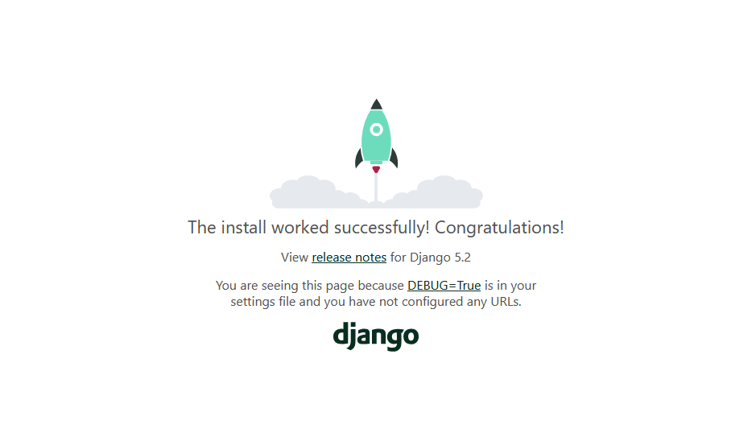

#next up: finish migrations/models.py

- This project is called DjangoTest.

- before you begin:
  - be sure to run `pip install -r requirements.txt` to download the necessary requirements to run this program

- To start the server, navigate to the DjangoTest/ folder in Powershell and run `Python manage.py runserver`
    - You should now have a webpage to view:

- This project has the following applications:
  - giveaway
    - data models (models.py):
      - giveaway - start/end dateed, title, terms, etc
      - entry - user entering a giveaway
      - winner - user who wins a giveaway
      - prize - the item given away
      - (optional ?) claim - how/when a winner claimed their prize
    - winner selection logic (views.py, services.py)
    - email notification
      - will probably call send_mail() or integrate with MailerLite
    - entry form (forms.py, /templates/giveaway/entry_form.html)
    - staff dashboard functions (views.py -> may move to admin.py, management/commands, api/views.py)
    - exports and logging
- projected applications:
  - accounts
    - user registration/login/logout
    - user, staff, promotions, compliance, admin
    - password reset
    - possibly: extra fields like DOB, station, etc
  - core
    - shared mixins
    - logging/auditing functions
    - global validators, helpers
    - base models
    - global constants
  - dashboard (optional for custom internal UI)
    - staff and promotions views
    - tablet-friendly dashboard
    - prize inventory alerts
    - winner search/filtering
    - prize claim management
    - undo/reassign winners
  - auditlog (optional)
    - track login timestamps
    - track who selected winners, edited prizes, etc
    - log exports and critical actions
  - notifications (optional)
    - send emails (winners, staff alerts)
    - alert if unclaimed after 40 days
    - notify promotions when claimed
    - SMS or push notifs later